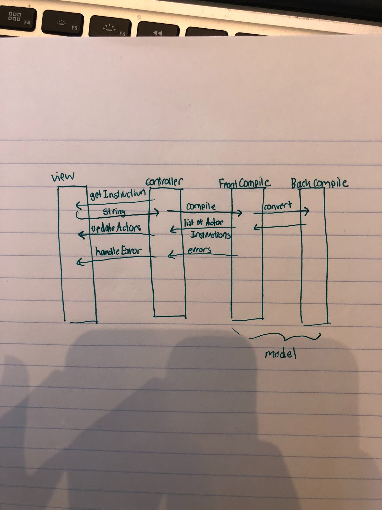
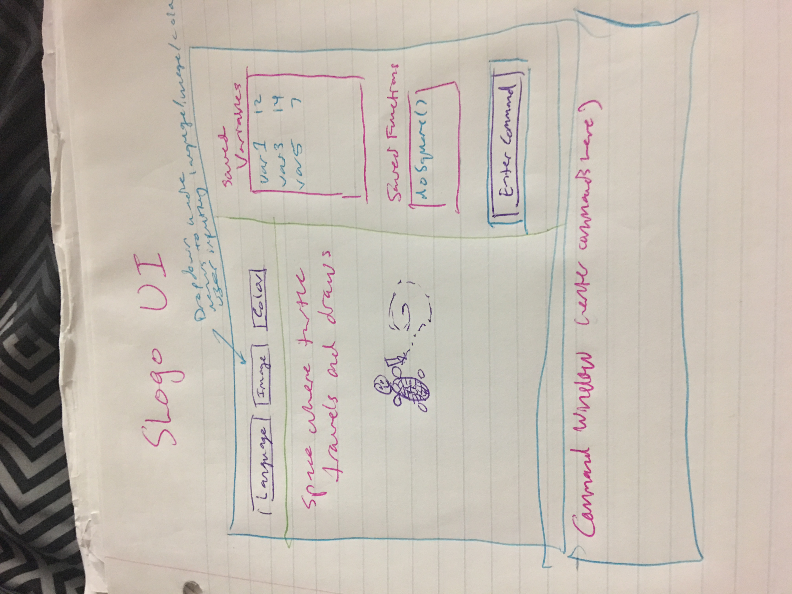

### Introduction  
                                
The primary design goal of this project is to implement a SLOGO program using the MVC design pattern. This will allow for flexibility of interchanging different models and views  because it will eliminate the need for any direct communication between the front end and back end. This closes the controller to modification but opens the implementation of the model and view to extension as long as the external APIs of the model and view are held consistent. 
Since the primary design pattern will use an MVC model, the model and view (front end and back end) are completely closed from each other. The only module that will access the public methods is the controller which will act as an interface between the model and view as it sends information back and forth between the two depending on user input. It will do so in the API layed out in the design overview.
Our goal with our API design is to keep our APIs small and concise. Eliminating large amounts of open functions will reduce the pain points of changing and extending classes. In general, our controller will take the input from the front end, decode it with the back end, and then communicate the results of that decoding back to the front end. 
	
### Design Overview

Our Main class will create a new UserSession, which will instantiate the necessary front end and back end classes. In general our design will be centered around our UserSession class. Our UserSession class will listen for an input of an instruction, it will then complete the following interactions with our model and view external APIs: 
* Request the instruction currently in the location in which the user is able to type. This will return a String.
* Pass that instruction to the back end. This will be a call to the FrontCompile which will perform lexical, syntactic, and semantic analysis. Any errors in the code will be thrown here.
* FrontCompile will call BackCompile which will convert the intermediate code that it generates into a list of ActorInstruction
* ActorInstruction will have an xChange, yChange, degreeChange, and output value.
* The final list of ActorInstructions will be returned to the controller.
* The controller will send this list of ActorInstructions to the Front End
* The front end will then iterate through these instructions and execute each on the views as well as generate any lines.
* Protects the back end from needing to know anything about the turtle
* Encapsulates any interactions with views to the front end



### User Interface

The UserSession will receive any errors from the back end and send the error to a error handler function in the front end. This handling will be encapsulated the front end.


##### Internal Front End: 

The internal front end API will deal with creating and updating the view. A MainView class will handle updating the turtle position and orientation as well as its status, and create any of the lines if the pen is down. A Turtle class will be responsible for encapsulating all this information and allow turtle status to be tracked and modified more easily.

##### External Front End: 

This API will be responsible for communicating with the UserSession controller to send and receive information to the back end. A UserInput class will be responsible for directly interacting with users by taking in instructions and sending them to the FrontCompile which will be the first step in exception handling and preparing it to be in a usable form for the back end. Once these instructions are properly compiled and processed in the back-end, it will be returned to the front end as an ActorInstruction class (handled by the back-end) which will contain all the necessary information. The controller would extract this information and return it to the front-end which can use this to update the view. This would be the task of an InstructionHandler class which takes in and passes the information along while updating the instruction history display.  

##### Internal Back End: 

The internal Back end API will involve the creation of actual ActorInstructions. The BackCompiler will implement an interface that requires a decode function which will take in the intermediate instructions created by the FrontCompile and convert them into a list of ActorInstructions.

##### External Back End: 

The external back end will consist of the interface between the controller and the front compiler. Therefore the FrontCompiler will implement the interface and will have a method to compile the code. There will also be functions to perform lexical, syntactic, and semantic analysis that will need to be implemented by FrontCompiler. 
The purpose of this API is to interact with the controller in a way that allows the instructions to be validated. Any errors will be thrown by the functions mentioned above. The Compile method will return a final result of a list of ActorInstructions which will be structured to contain a xChange, yChange, degreeChange and returnValue.

### User Interface

##### Basic components: 
* command box where user will type
* the ‘canvas’ that the turtle draws on 
* a box on the side to show variables/data saved by the user, 
* Up arrow the past history commands
* Dropdown menus for languages, pen color, turtle image on top of screen	
* Erroneous situations reported to the user: 
    * Color for turtle entered incorrectly
    * Image file selected is not of proper format
    * Language file not found



### API Details 
##### Internal Front End:
* MainGUI class which actually displays the turtle and drawings from inputs given from the controller
* MainGUI class will also contain event handlers and error checking methods for the different graphical components in the View
    * Pen color select menu
    * Turtle image select menu
    * Language select menu
    * Saved variables box
    * Saved functions box
* updateView method - void, changes the coordinates and/or orientation of the turtle/draws based on (MainGUI class contains JavaFX Scene + encapsulated state)
* Turtle class which handles turtle information on the front-end side
* Changes turtle status (setTurtleStatus method)
* ErrorHandler abstract class which takes in error processing outputs from the controller and displays the corresponding error message


##### External Front End:
* UserInput class which asks users for instructions and sends them to the controller
* Sends user instructions to the controller (UserSession class) with a getter (getUserInstruction method -> returns two Strings- one that represents the user instruction that was just typed into the command box, and another that is the current language selected by the user) to give to the back-end
* Sends turtle information to the controller (UserSession class) with a getter (getTurtle method -> returns TurtleStatus, which is the x coordinate of the turtle, the y coordinate of the turtle, the orientation of the turtle, and whether the pen is down or not) to give to the back-end

##### Internal Back End 
* Communication between FrontCompile and BackCompile
    * BackCompile will need to implement a function called Decode that takes in intermediate instructions created by frontCompile (most likely in a Map or list form) and outputs a list of ActorInstructions. 
    * FrontCompile will call decode(intermediateInstructions) and then return the result to the controller.
    * FrontCompile will likely need to communicate with a LexicalAnalysis class, a SyntaxAnalysis class and a SemanticAnalysis class. It will wrap these interaction in the external methods for completing each kind of analysis. 
    * SLogo basic commands: 
(https://www2.cs.duke.edu/courses/compsci308/current/assign/03_slogo/commands.php#gsc.tab=0)

##### External Back End: (FrontCompile)
* List<ActorInstruction> Compile(String instruction, String language)
        * Will perform all of the front compile and detect any errors. 
* List<Token> lexicalAnalysis(String instruction)
        * Throws lexicalError → extends CompileError
* Tree<Token> syntaxAnalysis(List<Token>)
        * Throws syntaxError → extends CompileError
* Tree<Token> semanticAnalysis(Tree<Token>)
        * Throws semanticError → extends CompileError
* Map<String, Map> getSavedInformation()
        * This will return a map of all saved variables and a map of all saved functions
Some errors thrown include lexical errors (invalid instruction), syntax errors (missing brace), semantic errors (variables not defined before use) 

### API Example Code

#### User types ‘fd 50’

**Controller Class:** 
```java
addEventListener(ENTERBUTTON.clicked, handleInstruction);                   
Void handleInstruction(String instruction) throws CompileError {                
	String instruction = View.getInstruction(); //returns fd 50                             
	List<ActorInstruction> actorInstructions =  FrontCompiler Compiler.compile(instruction);                
	View.executeInstructions(actorInstructions);                                       
	Map<string, list<string>> savedInformation = FrontCompler.getSavedInformation();                 
	View.updateDisplayedInformation(savedInformation)                     
}                    
```

**View:**
```java
List<String>  getInstruction(){                                  
	Return content of text box and string representing language                      
}                                                         
Void updateDisplayedInformation(Map<String, List<string>){                                   
	//update the displays of the saved variables, history of instructions and saved functions               
}                                                                  

Void executeInstructions(List<ActorInstruction> instructions){                                             
	//iterate through instructions, update the view for the turtle and draw a line between each instruction point             
}                               
```

**FrontCompiler:**
```java
List<ActorInstruction> compile(String instruction){                             
	//load language, do all analysis etc, create an intermediate form of code               
intermediateInstructions = {T2:= Fd T1, T1 := 50}                                              
	List<ActorInstruction> finalInstructions = BackCompiler.convert( intermediateinstructions)               
	instructionHistory.put(instruction, finalInstructions)                      
	Return finalInstructions                   
}                       
```


**BackCompiler:**
```java
List<ActorInstruction> convert(List<IntermediateInstruction>intermediateinstructions){                   
	//return a list of actorInstructions                   
	T1ActorState = {                   
		xChange: 0              
		yChange: 0               
		degreeChange: 0            
		returnValue: 50             
	}        
	
   T2ActorState = {          
		xChange: number           
		yChange: number           
		degreeCange: 0           
		returnValue: 50           
	} 
	
Return List<Actor State> {T1Actor State, T2Actor State}
}
```


* Note, clearly show the flow of calls to public methods needed to complete this example, indicating which class contains each method called. It is not necessary to understand exactly how parsing works in order to complete this example, just what the result of parsing the command will be.
Additionally, each member of the team should create two use cases of their own (and example code) for the part of the project for which they intend to take responsibility. These can still be done as a group, but should represent a variety of areas of the overall project.

**Marley**

##### Use case 1: User types fwd XCor
**FrontCompile:**
```java
List<ActorInstruction> compile(String instruction){              
	List<Tokens> tokens = completeLexicalAnalysis(instruction)                   
	//tokens = [fwd, XCor]                             
	Tree<Tokens> AST = completeSyntaxAnalysis(tokens)                   
	// tree  fwd → XCor                                       
	Tree<Tokens> annotatedAST = completeSemanticAnalysis(AST)              
	// insert any variable values, // tree  fwd → Turtle.getXLocation()                
	//load language, do all analysis etc, create an intermediate form of code                                   
	List<IntermediateInstructions> intermediateInstructions = generateIntermediateInstructions(annotatedAST);               
	// intermediateInstructions = {T2:= Fd T1, T1 := Turtle.getXLocation()}                     
	List<ActorInstruction> finalInstructions = BackCompiler.convert( intermediateinstructions)              
	instructionHistory.put(instruction, finalInstructions)                 
	Return finalInstructions             
}
```
                                    

**BackCompile:**
```java
List<ActorInstruction> convert(List<IntermediateInstruction>intermediateinstructions){               
	//return a list of actorInstructions                 
	T1ActorState = {              
		xChange: 0                
		yChange: 0             
		degreeChange: 0                      
		returnValue: Turtle.getXLocation()                 
	}              
	
   T2ActorState = {                                                  
		xChange: Turtle.getXLocation() * cos(Turtle.getDirection());                
		yChange:  Turtle.getXLocation() * sin(Turtle.getDirection());             
		degreeChange: 0                     
		returnValue: Turtle.getXLocation()              
	}         
	
Return List<Actor State> {T1Actor State, T2Actor State}                    
}
```


##### Use case 2: REPEAT 2 [ fwd x] assume x is a saved variable
**FrontCompile:**
```java
List<ActorInstruction> compile(String instruction){                   
	List<Tokens> tokens = completeLexicalAnalysis(instruction)                  
	//tokens = [Repeat,2, ‘]’, fwd, x, ‘]’]                    
	Tree<Tokens> AST = completeSyntaxAnalysis(tokens)               
	// tree  	2 ← Repeat → fwd → 50                     
	Tree<Tokens> annotatedAST = completeSemanticAnalysis(AST)                   
	// insert any variable values, // tree  2 ← Repeat → fwd → 50              
	//load language, do all analysis etc, create an intermediate form of code                                
	List<IntermediateInstructions> intermediateInstructions = generateIntermediateInstructions(annotatedAST);                  
	// intermediateInstructions = {T3:= T2 T2:= fwd T1, T1: = 50}                             
	List<ActorInstruction> finalInstructions = BackCompiler.convert( intermediateinstructions)                
	instructionHistory.put(instruction, finalInstructions)                     
	Return finalInstructions                                             
}   
```

**BackCompile:**
```java
List<ActorInstruction> convert(List<IntermediateInstruction>intermediateinstructions){            
	//return a list of actorInstructions             
	T1ActorState = {             
		xChange: 0               
		yChange: 0                    
		degreeChange: 0                 
		returnValue: 50               
	}      
	         
T2ActorState = {                  
		xChange: 50 * cos(Turtle.getDirection());                  
		yChange:  50* sin(Turtle.getDirection());                 
		degreeChange: 0              
		returnValue: 50                  
	}      
	                            
T3ActorState =  {                                    
		xChange: 50 * cos(Turtle.getDirection());                  
		yChange:  50* sin(Turtle.getDirection());               
		degreeChange: 0           
		returnValue: 50             
	}                
	
Return List<Actor State> {T1Actor State, T2Actor State, T3ActorState }
}
```


###### Ryan (Internal Front End API)

Use case 1: User selects “Image” menu on GUI and selects the option to “choose image from file”
* Event handler method imageSelectHandle() in MainGUI class opens JavaFX FileChooser object.
* User selects file
* Error checking method validateImageFile() in MainGUI class ensures that the file is of proper format to be loaded as a turtle image
* MainGUI class’s imageFile instance variable is updated to be the file selected by the user
* MainGUI class “updateView(Turtle x, line objects)” method is called to swap the current turtle’s image with the new file selected by the user

Use case 2: User selects “Pen” menu on GUI and selects option to “set pen color”

* Event handler method colorSelectHandle() in MainGUI class opens dialog box with text fields for R,G,and B values for the new pen color
* User enters values
* Error checking method validateColor() in MainGUI ensures that the values entered were correct RGB values. If color is invalid the user is informed of this via an error message in the dialog box
* MainGUI class’s penColor instance variable is updated 

###### Ethan

Use case 1: A new instruction is added to the user history    
Use case 2: A new instruction is added which results in an error being thrown


###### Janice

##### Use case 1: LEFT 45                             
**FrontCompile:**                                                
```java
//check for any errors before converting into intermediateInstruction            
//Since the instruction is LEFT, should check that the degrees fall between 0 and 180                
List<ActorInstruction> compile(String instruction){                        
intermediateInstructions = {break down the String that has been screened}                       
	List<ActorInstruction> finalInstructions = BackCompiler.convert( intermediateinstructions)                  
	instructionHistory.put(instruction, finalInstructions)             
	Return finalInstructions                
}
```
                   

**BackCompiler:**
```java
List<ActorInstruction> convert(List<IntermediateInstruction>intermediateinstructions){                    
	                                                	//update ActorStates T1, T2 here                       
		returnValue: 45
	}
Return List<Actor State> {ActorStates}
}
```


##### Use case 2:  SETXY x y 
**FrontCompile:**
```java
//check for any errors in the format of the instruction                   
//basically same process as before:                                          
//convert to intermediate instructions if what the user put in has been valid                   
//use BackCompiler to convert those instructions to finalInstructions                
//Make sure you store those finalInstructions in the log (List)  
```
             
**BackCompiler:**
```java
//The convert method implemented here. T1 = x T2 = y, T3 = SETXY                           
//part of what will be returned includes the distance                                    
	
T1ActorState = {              
		xChange: 0                     
		yChange: 0                
		degreeChange: 0                                                  
		returnValue: distance between turtle’s old and new position (x y)             
	}                      

T2ActorState = {                                         
		xChange: the distance required to move the turtle               
		yChange:  0                   
		degreeChange: 0                                                     
		returnValue:  distance between turtle’s old and new position (x y)                     
	}                   
 
T3ActorState = {                                                                          
	 	xChange: the distance required to move the turtle from original x loc to input x                   
		yChange: distance required to move the turtle from the original y loc to input y                     
		degreeChange: 0                                                      
		returnValue:  distance between turtle’s old and new position (x y)                     
}                                  

//return the list of ActorStates, T1, T2 and T3
```

### Design Considerations 
Discussions: 
Originally the team had discussed the back end directly creating and altering views and then passing back a list of views to the front end. However, we realized that this would make passing back a return value from a command such as a query difficult to do. Instead we decided to move all interactions with views into the front end, which encapsulates all turtle interactions, hiding the from the back end and allows the front end to change views as necessary. For example, a  pro of this would be if the Front end moved from a rectangle turtle to an imageView turtle, the back end previously would have been impacted (setImageWidth and setImageHeight etc), but now, all of these changes will be handled internally by the front end. In addition, we no longer require information from the front end about the turtle. 

**Whose responsibility is it to check the format of the instruction for validity (front end or backend)?**
Instruction validity will be handled by the FrontCompile in the back-end which will perform lexical, syntactic, and semantic analysis to ensure that the instruction format is correct and that it is an actual instruction. BackCompile will convert this to ActorInstructions which will be returned to the front-end in a format readable to it. 

**How will command history be displayed/interacted with by the user?**      
Have history of commands: double clicks on a command in history, that command should reappear in the text box, then press enter in order to go through the same decoding process as before
### Team Responsibilities
This section describes the program components each team member plans to take primary and secondary responsibility for and a high-level plan of how the team will complete the program.

* Janice, Marley
  * Marley: mostly responsible for compiling the instructions into the intermediate language and error checking. 
Converting this into actor state

   * Janice: 
        * parsing and handling languages,
        * controller class    
        * ActorInstruction class
        * Also work on converting intermediate into actor state etc. 

* Ethan, Ryan
    * Ethan 
        * UserInput (command box - displaying command errors, interacting with command history, stored variables, displaying results of functions/queries)
        * InstructionHandler (receives the ActorInstructions information and passes it along while updating the user history display)
    * Ryan
         * View, Turtle (main display and UI, handling updates given from external back end)


